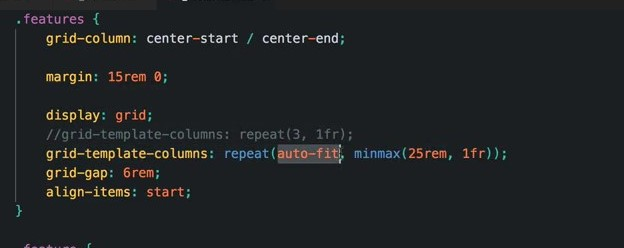
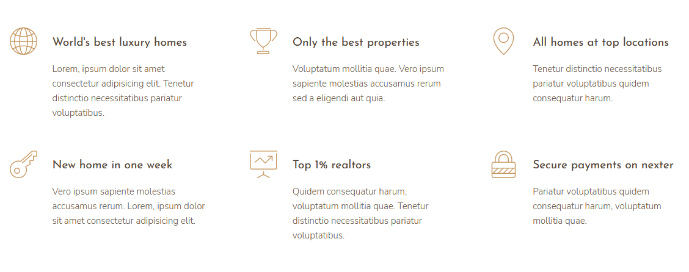
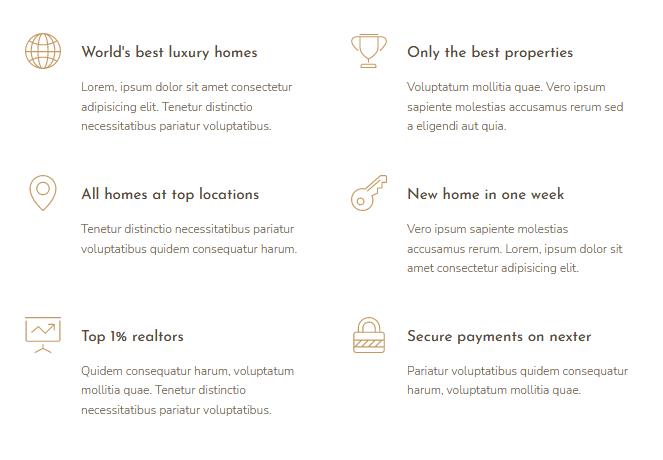
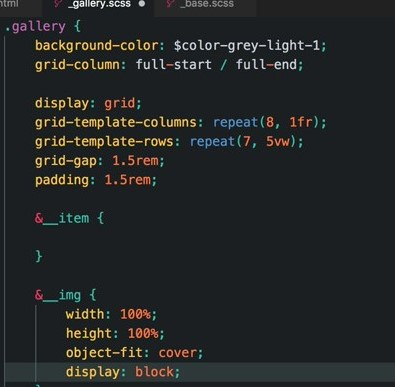
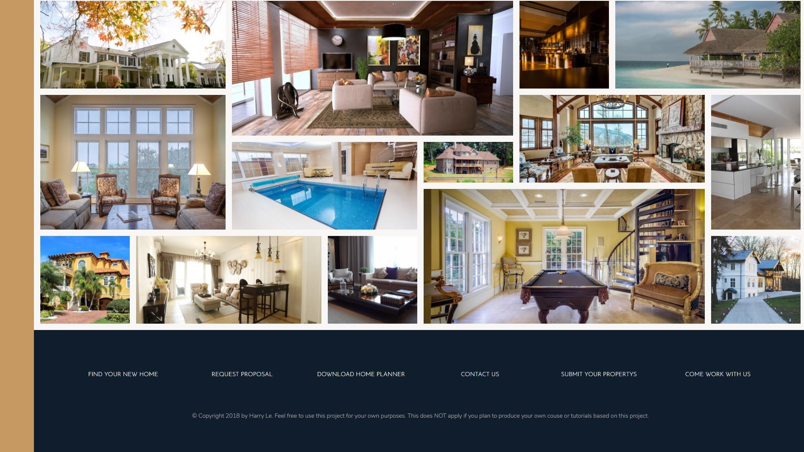

# 
# General info
"Nexter" is a third project I have worked on, following along
with Jonas Schmedtmann's <a href="https://www.udemy.com/course/advanced-css-and-sass/">Advanced CSS and Sass course.</a>
This project is focused on using <i>CSS grid</i> for overall layout of the page.

<i>CSS grid </i> is a two-dimensional layout system and it workes in a way that applies <i>CSS</i> rules to both parent element (Grid Container) and 
to that element children elements (Grid Items).

Find out more about <i>CSS grid</i> at:  <a href="https://css-tricks.com/snippets/css/complete-guide-grid/">A complete guide to Grid</a>

## Live preview

<a href="https://nexter-git-main.johnny415.vercel.app/">Click here for live preview!</a>

## Technologies

<ul>
<li>CSS Grid</li>
<li>7-1 Patern</li>
<li>SCSS(BEM)</li>
<li>Responsive Web Design</li>
<li>SVG Icons</li>
</ul>

## What I've learned?

There are many useful different <i>CSS</i> techniques and methods that are introduced througout this project.

I, perosnaly, found very useful techniques how to build responsive layouts using <i>"minmax"</i> functions in combination
with <i>"auto-fill"</i> and <i>"auto-fit"</i> keywords to achive responsive layouts without writing media queries.

Here is an example:

Screen width 1200px:

Screen width 600px:

Also, creating complex grid-looking gallery of images is quite easy task with using  <i>"repeat"</i> function for 
creating as many rows and columns as we need and using <i>"object-fit"</i> property on our images so they don't overflow grid cells,as shown on example below.

Consedering arhitecture of the code, in this project i used <i>BEM</i> methodology, and i also implemented 
7-1 <i>SASS</i> pattern which is a great way for structuring your files.

### Browser support

In the end i will mention that <i>CSS Grid</i> is supported in all major browsers,but there are some exceptions.

<a href="https://caniuse.com/css-grid">Check here for browser support for CSS Grid</a>
